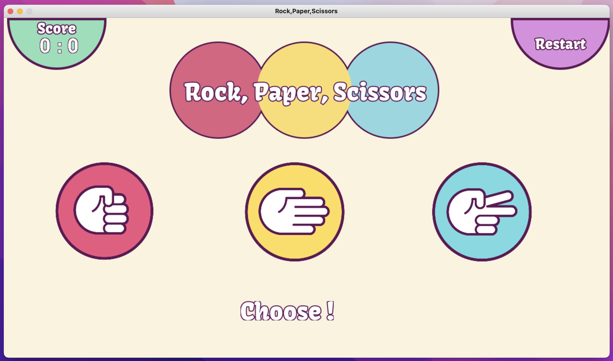
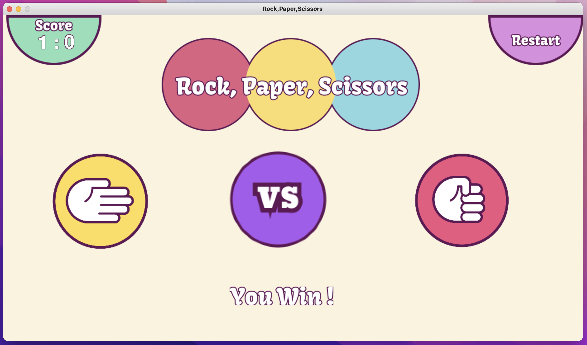
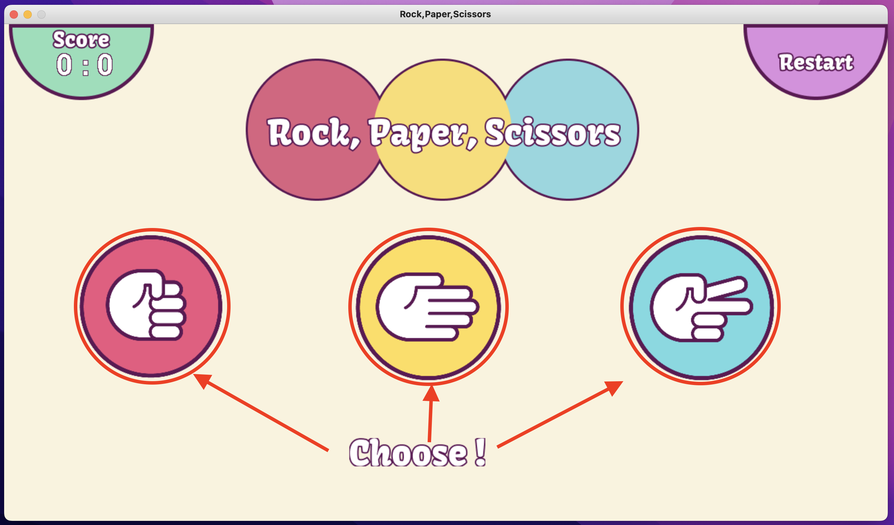
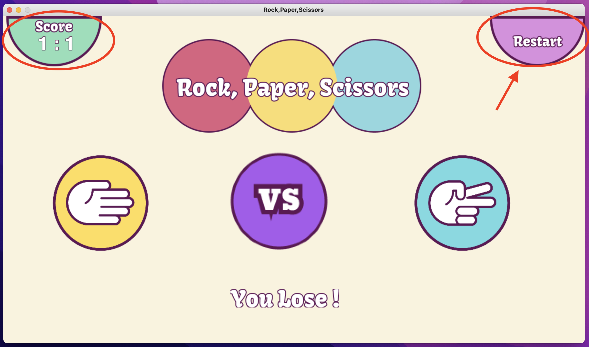

# Rock Paper Scissors Game

------------------
## Description

**Simple game of Rock, Paper, Scissors**
- This Repository holds code for a simple game of "Rock, Paper, Scissors" with a GUI (Graphical User Interface).

## Game Interface

## Game Instructions
- Click with your mouse/trackpad one of the options (Rock, Paper or Scissors pictures) on the screen. Shown below in red.

- No need to try and keep score! We do that for you :)
- Press the 'Restart' Button on the screen (shown below in red) or press the "r" key on your keyboard when you are ready to play again. 

- if you wish to exit the game completely press the red button in the corner of the window or press the "q" key on your keyboard.

# Requirements 
* `pygame`

## Features

-----------------------
- [x] **Interactive Buttons**
- [x] **Sound**
- [x] **Dynamic Scoreboard & Messages**

------------------------
# Structure

### r_p_s_game.py

- Main script which runs the `GUI` game.

### button.py

- Script that `creates, updates and checks for user input` of the buttons in the game.

### game_outcome.py

- Contains the game rules for Rock, Paper Scissors.
- Decide the outcome of the game `Win, Lose or Draw`.

### Images

- Contains all the images required for the game.

### Sounds

- Contains all the Sounds required for the game. 
- Sound clips sourced from [Freesound](https://freesound.org/)

### Configuration Files

- .gitignore - ignores updates of certain files that should not be committed. 
- README.md - guide/breakdown to the game.

----

## How to Run
Below find the following steps required to launch & play the game.

<ol>
  <li>Open Terminal</li>
  <li>Change to "RockPaperScissors" directory using "cd"</li>
  <li>run the following command "python3 r_p_s_game.py" in the command line (CLI)</li>
  <li>Enjoy :)</li>
</ol>

----

### Improvements to be made

- Dynamic Reset - not having to press "Restart" button or "r" key to start a new game
- Fixing bugs

------

## Maintainers
* [shindym](https://github.com/shindym)

